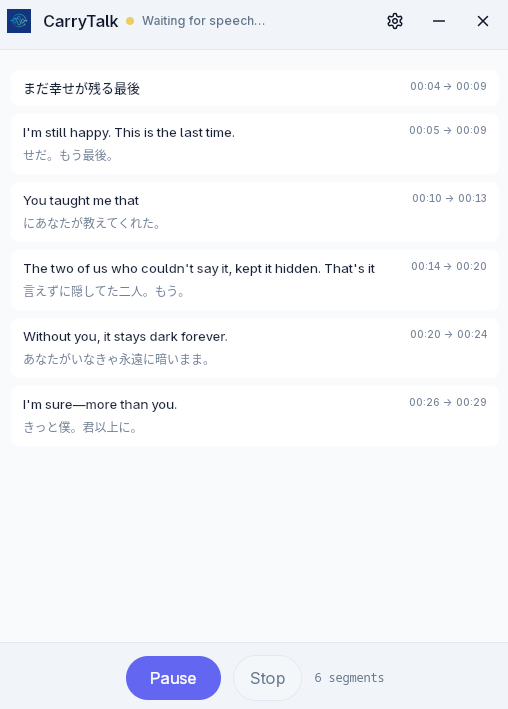
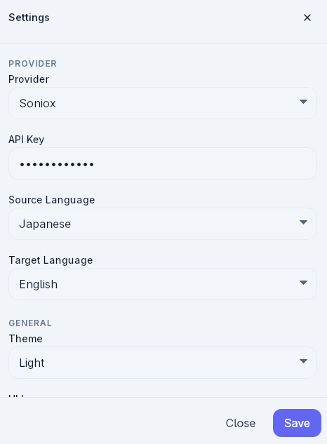

# CarryTalk

CarryTalk is a Tauri desktop app for real-time transcription and translation. It combines a Svelte-based desktop UI with a Rust-powered native layer to capture audio, stream speech data, and persist session output locally.

## Overview

CarryTalk is designed around a live transcription workflow:

- capture audio from available sources
- start, pause, resume, and stop transcription sessions
- display transcript updates in real time
- optionally show translated output alongside the original text
- save session data locally for later access and recovery

The current codebase includes a Soniox-based provider flow, desktop settings management, localized UI resources, and a native session pipeline built with Tauri and Rust.

<p align="center">
  
  
</p>

## Features

- **Real-time session lifecycle** with start, pause, resume, and stop controls
- **Live transcript rendering** with timestamps and support for original and translated text
- **Audio source configuration** for microphone, system audio, or mixed capture modes depending on runtime capabilities
- **Device selection support** for available audio inputs and outputs
- **Provider and API key management** through the settings flow
- **Local session persistence** using session folders, manifests, and JSONL transcript parts
- **Interrupted session recovery** on app startup
- **Desktop-friendly UI** with theme and language preferences
- **Built-in localization resources** for English and Vietnamese

## Tech Stack

### Frontend

- Svelte 5
- TypeScript
- Vite
- Tailwind CSS 4
- Tauri JavaScript APIs

### Native/Desktop

- Tauri 2
- Rust
- Tokio
- WebSocket-based streaming with `tokio-tungstenite`
- Audio capture with `cpal`
- Audio resampling with `rubato`
- Local secret handling with `aes-gcm` and `argon2`

## Installation

### Prerequisites

Before running the app, make sure your environment satisfies the system requirements for building Tauri applications on your platform.

### Clone the repository

```bash
git clone https://github.com/tuannt39/carry-talk.git
cd carry-talk
```

### Install dependencies

```bash
npm install
```

## Running the App

### Frontend development server

```bash
npm run dev
```

### Run the Tauri desktop app in development mode

```bash
npm run tauri -- dev
```

### Type and Svelte checks

```bash
npm run check
```

### Build the frontend

```bash
npm run build
```

### Build the desktop app

```bash
npm run tauri -- build
```

## Usage

1. Launch the application in development or from a built desktop bundle.
2. Open the settings panel and configure the current provider settings.
3. Add or update the required API key.
4. Choose the desired audio capture mode and device configuration.
5. Start a session to begin receiving live transcript updates.
6. View original and translated transcript text in the main transcript area.
7. Stop the session when finished. Session data is stored locally for recovery and listing.

## Project Structure

```text
carry-talk/
├── src/
│   ├── App.svelte                 # Application shell and startup flow
│   ├── main.ts                    # Frontend entrypoint
│   └── lib/
│       ├── components/            # UI components such as controls, settings, transcript view
│       ├── services/              # Tauri command and event wrappers
│       ├── stores/                # Frontend state stores
│       ├── i18n/                  # Localization resources
│       └── types/                 # Shared frontend types
├── src-tauri/
│   ├── src/
│   │   ├── main.rs                # Native entrypoint
│   │   ├── lib.rs                 # App bootstrap and shared state wiring
│   │   ├── commands.rs            # Tauri command surface
│   │   ├── session_manager.rs     # Session orchestration and streaming pipeline
│   │   ├── storage.rs             # Local session persistence and recovery
│   │   ├── settings.rs            # App settings persistence
│   │   └── secrets.rs             # Encrypted secret storage
│   └── tauri.conf.json            # Tauri app and build configuration
├── package.json                   # Frontend scripts and dependencies
└── README.md
```

## How It Works

At a high level, CarryTalk follows this flow:

1. The frontend loads app settings, current session state, and audio runtime capabilities.
2. When a session starts, the backend manages audio capture, streaming, transcript buffering, and local storage.
3. Transcript and session events are emitted back to the frontend through Tauri events.
4. The UI renders incoming transcript segments and keeps the visible session state in sync.

## Acknowledgements

This project was adapted and inspired by the following projects:

- [My Translator](https://github.com/phuc-nt/my-translator)
- [Node Trans](https://github.com/thainph/node-trans)
- [LiveCaptions Translator](https://github.com/SakiRinn/LiveCaptions-Translator)
- [Real-Time Translator](https://github.com/Vanyoo/realtime-subtitle)

## Contributing

Contributions are welcome.

If you want to contribute:

1. Fork the repository.
2. Create a feature branch.
3. Make focused, reviewable changes.
4. Run the relevant local checks.
5. Open a pull request describing the change clearly.

## License

This project is licensed under the MIT License.

## Contact

For questions, feedback, or support, please open an issue on GitHub:

- <https://github.com/tuannt39/carry-talk/issues>
